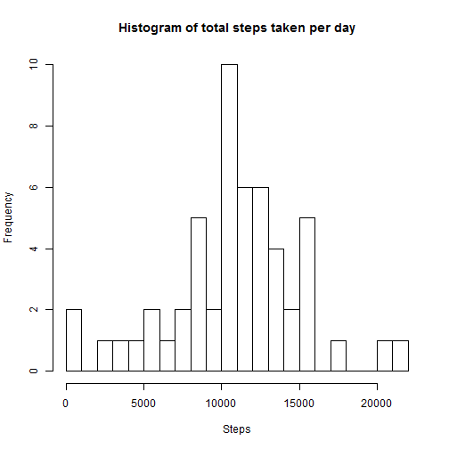
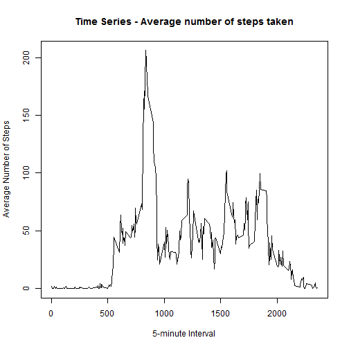
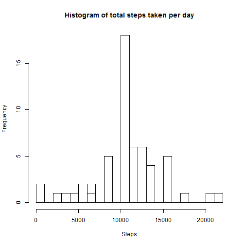
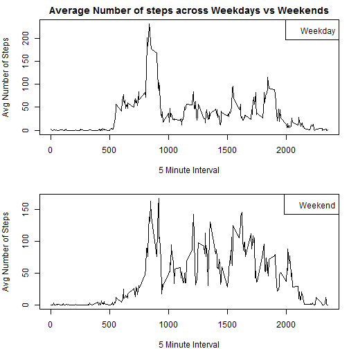

Reproducible Research: Peer Assessment 1
==========================================

Vinay Kowshik A

1/11/2017


*1. Reading the activity File*

```r
activity <- read.table(unz("activity.zip", "activity.csv"), header=T, quote="\"", sep=",")
```

*2. Process/transform the date component of the data file*

```r
activity$date <- as.Date(activity$date)
```

###What is mean total number of steps taken per day?

*Calculate the total number of steps taken per day*

```r
totalStepsPerDay = aggregate(steps ~ date, data = activity,na.rm = TRUE , FUN = sum)
```

*Make a histogram of the total number of steps taken each day*

```r
hist(totalStepsPerDay$steps,breaks = 20, main = "Histogram of total steps taken per day", xlab = "Steps", ylab = "Frequency")
```



*Calculate and report the mean and median of the total number of steps taken per day*

```r
Mean <- mean(totalStepsPerDay$steps)
```


```r
Median <- median(totalStepsPerDay$steps)
```

The mean & median of the total number of steps per day is 10766.1886792 and 10765 respectively

###What is the average daily activity pattern?

*Make a time series plot (i.e. type = "l") of the 5-minute interval (x-axis) and the average number of steps taken, averaged across all days (y-axis)*

```r
AvgSteps <- aggregate(steps ~ interval, data = activity, FUN = mean, na.rm = TRUE)
plot(AvgSteps$interval, AvgSteps$step, type = "l",xlab = "5-minute Interval", ylab = "Average Number of Steps", main = "Time Series - Average number of steps taken")
```



*Which 5-minute interval, on average across all the days in the dataset, contains the maximum number of steps?*

```r
IntResult <- AvgSteps$interval[which.max(AvgSteps$steps)]
```

The 835th 5-Minute interval contains the maximum number of steps.


###Imputing missing values

*Calculate and report the total number of missing values in the dataset (i.e. the total number of rows with NAs)*

```r
MissingValues <- sum(is.na(activity$steps))
```

The number of missing values in the dataset is 2304


*Devise a strategy for filling in all of the missing values in the dataset. The strategy does not need to be sophisticated. For example, you could use the mean/median for that day, or the mean for that 5-minute interval, etc.*

*Create a new dataset that is equal to the original dataset but with the missing data filled in.*

```r
newActivity <- activity
for(i in AvgSteps$interval){
    newActivity[newActivity$interval == i & is.na(newActivity$steps), ]$steps <- AvgSteps$steps[AvgSteps$interval==i]
}

head(newActivity)
```

```
##       steps       date interval
## 1 1.7169811 2012-10-01        0
## 2 0.3396226 2012-10-01        5
## 3 0.1320755 2012-10-01       10
## 4 0.1509434 2012-10-01       15
## 5 0.0754717 2012-10-01       20
## 6 2.0943396 2012-10-01       25
```

*Make a histogram of the total number of steps taken each day and Calculate and report the mean and median total number of steps taken per day. Do these values differ from the estimates from the first part of the assignment? What is the impact of imputing missing data on the estimates of the total daily number of steps?*


```r
TotStepsNewActivity <- aggregate(steps ~ date, data = newActivity, FUN = sum, na.rm = TRUE)
hist(TotStepsNewActivity$steps, breaks = 20,main = "Histogram of total steps taken per day", xlab = "Steps", ylab = "Frequency")
```



```r
MeanNewActivity <- mean(TotStepsNewActivity$steps)
MedianNewActivity <- median(TotStepsNewActivity$steps)
```

The new mean & median of the total number of steps per day after imputing NAs is 10766.1886792 and 10766.1886792 respectively


###Are there differences in activity patterns between weekdays and weekends?

*For this part the weekdays() function may be of some help here. Use the dataset with the filled-in missing values for this part.*


*Create a new factor variable in the dataset with two levels - "weekday" and "weekend" indicating whether a given date is a weekday or weekend day.*


```r
newActivity$day <- weekdays(newActivity$date)
newActivity$week = ""
newActivity[newActivity$day == "Saturday" | newActivity$day == "Sunday", ]$week = "Weekend"
newActivity[newActivity$week == "", ]$week = "Weekday"
newActivity$week <- factor(newActivity$week)
str(newActivity)
```

```
## 'data.frame':	17568 obs. of  5 variables:
##  $ steps   : num  1.717 0.3396 0.1321 0.1509 0.0755 ...
##  $ date    : Date, format: "2012-10-01" "2012-10-01" ...
##  $ interval: int  0 5 10 15 20 25 30 35 40 45 ...
##  $ day     : chr  "Monday" "Monday" "Monday" "Monday" ...
##  $ week    : Factor w/ 2 levels "Weekday","Weekend": 1 1 1 1 1 1 1 1 1 1 ...
```

*Make a panel plot containing a time series plot (i.e. type = "l") of the 5-minute interval (x-axis) and the average number of steps taken, averaged across all weekday days or weekend days (y-axis). See the README file in the GitHub repository to see an example of what this plot should look like using simulated data.*


```r
AvgStepsNewActivity <- aggregate(steps ~ interval + week, data = newActivity, FUN = mean)
par(mfrow = c(2,1), mar = c(4,4,2,1))
with(subset(AvgStepsNewActivity, week == "Weekday"), plot(interval,steps,xlab = "5 Minute Interval", ylab = "Avg Number of Steps",type = "l",main = "Average Number of steps across Weekdays vs Weekends"))
legend("topright", legend = "Weekday")
with(subset(AvgStepsNewActivity, week == "Weekend"), plot(interval,steps,xlab = "5 Minute Interval", ylab = "Avg Number of Steps", type = "l"))
legend("topright", legend = "Weekend")
```


